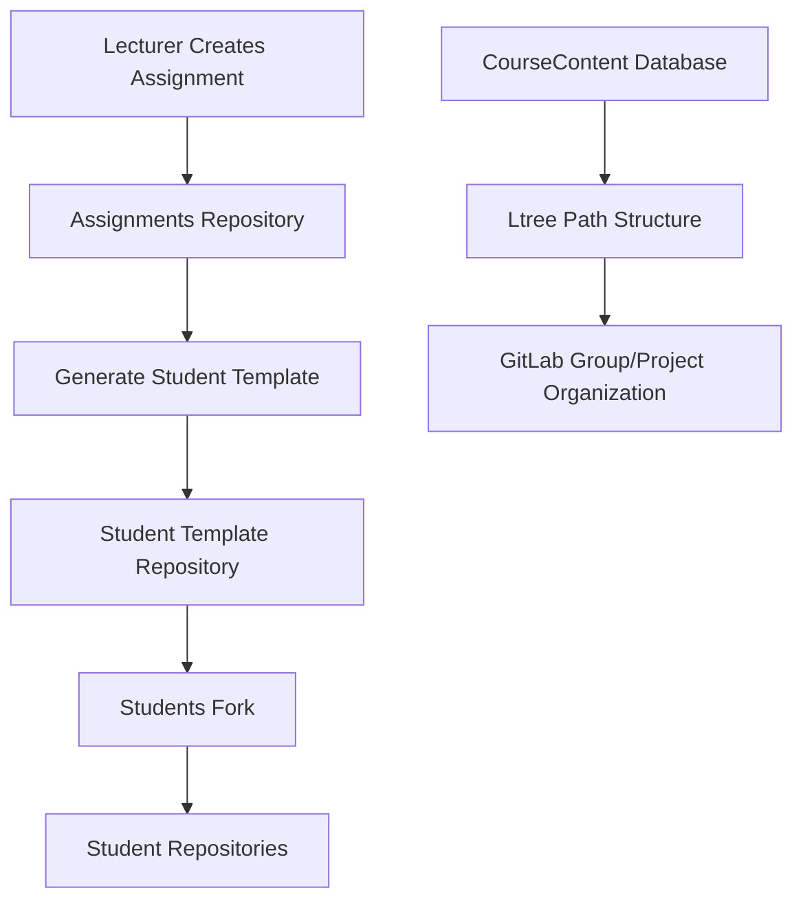
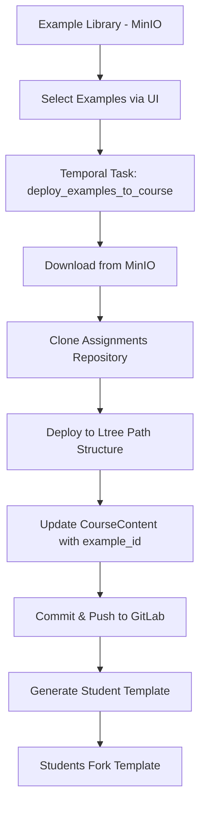

# Example Deployment Strategy

**Date**: 2025-07-30  
**Status**: Investigation & Design Phase  
**Purpose**: Design system for deploying examples from Example Library to course Git repositories

## Overview

This document outlines the strategy for bridging the Example Library system with the existing Git-based course workflow. The goal is to enable lecturers to select examples from the library and automatically deploy them to course repositories while maintaining the current student workflow.

## Current Architecture Analysis

### Existing Repository Structure

The current system uses three Git repositories per course:

1. **Assignments Repository** (`{course-path}-assignments.git`)
   - Contains reference solutions and test files
   - Lecturer's working repository
   - Source for generating student templates

2. **Student Template Repository** (`{course-path}-student-template.git`)
   - Generated from assignments repository
   - Contains skeleton code and instructions
   - Students fork this repository

3. **Reference Repository** (`{course-path}-reference.git`)
   - **Status**: Potentially obsolete with Example Library
   - Previously contained canonical solutions
   - May be replaced by MinIO storage in Example Library

### Current Course Content Flow



## Proposed Integration Strategy

### New Deployment Workflow



### Key Components

#### 1. Example Selection Interface
- **Location**: Course Detail Page (`/admin/courses/{id}`)
- **Integration**: Extend existing course content management
- **Features**:
  - Browse Example Library from course content creation
  - Select specific example versions
  - Preview example metadata and dependencies
  - Assign to specific CourseContent path

#### 2. Deployment Task System
- **Technology**: Temporal.io workflow (consistent with existing system)
- **Task Name**: `deploy_examples_to_course`
- **Inputs**: course_id, course_content_id, example_id, example_version, target_path
- **Outputs**: Deployed files in assignments repository + updated CourseContent

#### 3. Repository Integration Points
- **Assignments Repository**: Receives deployed examples at Ltree paths
- **CourseContent Model**: Updated with example_id and example_version fields
- **Student Template Generation**: Modified to handle example-sourced content

## Detailed Technical Design

### Enhanced CourseContent Model

```python
class CourseContent(Base):
    # ... existing fields ...
    
    # Example Library Integration
    example_id = Column(UUID(as_uuid=True), ForeignKey("example.id"), nullable=True)
    example_version = Column(String(64), nullable=True)  # e.g., "v1.0", "latest"
    
    # Deployment Tracking
    deployed_at = Column(DateTime(timezone=True), nullable=True)
    deployment_status = Column(String(32), default="pending")  # pending, deploying, deployed, failed
    deployment_task_id = Column(String(128), nullable=True)  # Temporal workflow ID
    
    # Customization Tracking
    is_customized = Column(Boolean, default=False)  # True if modified after deployment
    last_customized_at = Column(DateTime(timezone=True), nullable=True)
    
    # Relationships
    example = relationship("Example", back_populates="course_contents")
```

### Temporal Workflow: `deploy_examples_to_course`

```python
@workflow.defn
class DeployExamplesToCourseWorkflow:
    @workflow.run
    async def run(self, params: DeployExamplesParams) -> DeployExamplesResult:
        """
        Deploy selected examples from Example Library to course assignments repository.
        
        Args:
            course_id: Target course UUID
            deployments: List of (course_content_id, example_id, example_version, target_path)
        
        Returns:
            DeployExamplesResult with success/failure details
        """
        
        # Step 1: Validate inputs and check permissions
        validation_result = await workflow.execute_activity(
            validate_deployment_request,
            params,
            start_to_close_timeout=timedelta(minutes=2)
        )
        
        if not validation_result.valid:
            return DeployExamplesResult(success=False, errors=validation_result.errors)
        
        # Step 2: Download examples from MinIO/Example Library
        download_result = await workflow.execute_activity(
            download_examples_from_library,
            params.deployments,
            start_to_close_timeout=timedelta(minutes=10)
        )
        
        # Step 3: Clone/update assignments repository
        repo_result = await workflow.execute_activity(
            prepare_assignments_repository,
            params.course_id,
            start_to_close_timeout=timedelta(minutes=5)
        )
        
        # Step 4: Deploy examples to repository paths
        deployment_results = []
        for deployment in params.deployments:
            result = await workflow.execute_activity(
                deploy_single_example,
                DeploySingleExampleParams(
                    course_id=params.course_id,
                    course_content_id=deployment.course_content_id,
                    example_files=download_result.examples[deployment.example_id],
                    target_path=deployment.target_path,
                    example_metadata=download_result.metadata[deployment.example_id]
                ),
                start_to_close_timeout=timedelta(minutes=5)
            )
            deployment_results.append(result)
        
        # Step 5: Handle dependencies and cross-references
        dependency_result = await workflow.execute_activity(
            resolve_example_dependencies,
            ResolveDependendiesParams(
                course_id=params.course_id,
                deployments=deployment_results,
                repository_path=repo_result.local_path
            ),
            start_to_close_timeout=timedelta(minutes=10)
        )
        
        # Step 6: Commit and push changes
        commit_result = await workflow.execute_activity(
            commit_and_push_changes,
            CommitChangesParams(
                repository_path=repo_result.local_path,
                commit_message=f"Deploy {len(params.deployments)} examples from Example Library",
                deployments=deployment_results
            ),
            start_to_close_timeout=timedelta(minutes=5)
        )
        
        # Step 7: Update CourseContent records
        update_result = await workflow.execute_activity(
            update_course_content_deployment_status,
            UpdateDeploymentStatusParams(
                deployments=deployment_results,
                commit_hash=commit_result.commit_hash,
                deployment_timestamp=commit_result.timestamp
            ),
            start_to_close_timeout=timedelta(minutes=2)
        )
        
        return DeployExamplesResult(
            success=True,
            deployed_count=len([r for r in deployment_results if r.success]),
            failed_count=len([r for r in deployment_results if not r.success]),
            commit_hash=commit_result.commit_hash,
            deployment_results=deployment_results
        )
```

### Activity Implementations

#### `download_examples_from_library`

```python
@activity.defn
async def download_examples_from_library(
    deployments: List[ExampleDeployment]
) -> DownloadExamplesResult:
    """
    Download example files and metadata from MinIO storage.
    
    Returns:
        DownloadExamplesResult containing files and metadata for each example
    """
    
    examples_data = {}
    metadata_data = {}
    
    for deployment in deployments:
        try:
            # Get example metadata from database
            example = await get_example_by_id(deployment.example_id)
            if not example:
                raise ValueError(f"Example {deployment.example_id} not found")
            
            # Determine version to download
            version = deployment.example_version
            if version == "latest":
                version = await get_latest_example_version(deployment.example_id)
            
            # Download files from MinIO
            storage_path = f"repositories/{example.repository_id}/{deployment.example_id}/{version}/"
            files = await download_from_minio(storage_path)
            
            # Parse metadata
            metadata = None
            if 'meta.yaml' in files:
                metadata = yaml.safe_load(files['meta.yaml'])
            
            examples_data[deployment.example_id] = files
            metadata_data[deployment.example_id] = metadata
            
        except Exception as e:
            logger.error(f"Failed to download example {deployment.example_id}: {e}")
            raise
    
    return DownloadExamplesResult(
        examples=examples_data,
        metadata=metadata_data
    )
```

#### `deploy_single_example`

```python
@activity.defn
async def deploy_single_example(
    params: DeploySingleExampleParams
) -> DeploySingleExampleResult:
    """
    Deploy a single example to the assignments repository at the specified path.
    
    Args:
        params: Deployment parameters including files, target path, and metadata
        
    Returns:
        DeploySingleExampleResult with deployment status and details
    """
    
    try:
        # Create target directory structure based on Ltree path
        target_dir = Path(params.repository_path) / params.target_path.replace('.', '/')
        target_dir.mkdir(parents=True, exist_ok=True)
        
        # Copy example files to target directory
        for filename, content in params.example_files.items():
            if filename == 'metadata.json':  # Skip internal metadata
                continue
                
            target_file = target_dir / filename
            
            # Ensure subdirectories exist
            target_file.parent.mkdir(parents=True, exist_ok=True)
            
            # Write file content
            if isinstance(content, str):
                target_file.write_text(content, encoding='utf-8')
            else:
                target_file.write_bytes(content)
        
        # Update meta.yaml with course-specific settings
        if params.example_metadata:
            await update_meta_yaml_for_course(
                target_dir / 'meta.yaml',
                params.course_content_id,
                params.example_metadata
            )
        
        # Create .example-library file for tracking
        tracking_file = target_dir / '.example-library'
        tracking_data = {
            'example_id': str(params.example_id),
            'example_version': params.example_version,
            'deployed_at': datetime.utcnow().isoformat(),
            'course_content_id': str(params.course_content_id)
        }
        tracking_file.write_text(json.dumps(tracking_data, indent=2))
        
        return DeploySingleExampleResult(
            success=True,
            example_id=params.example_id,
            target_path=params.target_path,
            files_deployed=list(params.example_files.keys()),
            deployment_metadata=tracking_data
        )
        
    except Exception as e:
        logger.error(f"Failed to deploy example {params.example_id} to {params.target_path}: {e}")
        return DeploySingleExampleResult(
            success=False,
            example_id=params.example_id,
            target_path=params.target_path,
            error=str(e)
        )
```

#### `resolve_example_dependencies`

```python
@activity.defn
async def resolve_example_dependencies(
    params: ResolveDependenciesParams
) -> ResolveDependenciesResult:
    """
    Handle dependencies between deployed examples.
    
    This includes:
    - Updating import paths in dependent examples
    - Copying shared utility files
    - Updating meta.yaml testDependencies with new paths
    """
    
    dependency_updates = []
    
    for deployment in params.deployments:
        if not deployment.success:
            continue
            
        try:
            # Get example dependencies from database
            dependencies = await get_example_dependencies(deployment.example_id)
            
            if not dependencies:
                continue
            
            # Find where dependencies were deployed in this course
            dependency_paths = {}
            for dep in dependencies:
                dep_deployment = next(
                    (d for d in params.deployments if d.example_id == dep.depends_id),
                    None
                )
                if dep_deployment and dep_deployment.success:
                    dependency_paths[dep.depends_id] = dep_deployment.target_path
            
            # Update dependency references in deployed files
            if dependency_paths:
                await update_dependency_references(
                    params.repository_path,
                    deployment.target_path,
                    dependency_paths
                )
                
                dependency_updates.append({
                    'example_id': deployment.example_id,
                    'target_path': deployment.target_path,
                    'dependencies_updated': list(dependency_paths.keys())
                })
        
        except Exception as e:
            logger.error(f"Failed to resolve dependencies for {deployment.example_id}: {e}")
            # Continue with other deployments
    
    return ResolveDependenciesResult(
        success=True,
        dependency_updates=dependency_updates
    )
```

### Repository Structure After Deployment

```
course-assignments/
├── week1/                           # Ltree path: "week1"
│   ├── hello_world/                 # Ltree path: "week1.hello_world"
│   │   ├── .example-library         # Tracking file
│   │   ├── meta.yaml                # Course-customized metadata
│   │   ├── main.py                  # From Example Library
│   │   ├── test_main.py            # From Example Library
│   │   └── README.md               # From Example Library
│   └── variables/                   # Ltree path: "week1.variables"
│       ├── .example-library
│       ├── meta.yaml
│       ├── variables.py
│       └── test_variables.py
├── week2/                           # Ltree path: "week2"
│   └── functions/                   # Ltree path: "week2.functions"
│       ├── .example-library
│       ├── meta.yaml
│       ├── functions.py
│       ├── test_functions.py
│       └── utils.py                 # Dependency from variables example
└── .course-metadata
    ├── deployed-examples.json       # Master tracking file
    └── deployment-history.json     # Version history
```

### Example Library Tracking Files

#### `.example-library` (per deployment)
```json
{
  "example_id": "550e8400-e29b-41d4-a716-446655440000",
  "example_version": "v1.2",
  "deployed_at": "2025-07-30T14:30:00Z",
  "course_content_id": "123e4567-e89b-12d3-a456-426614174000",
  "original_directory": "hello-world",
  "dependencies": [
    {
      "example_id": "550e8400-e29b-41d4-a716-446655440001",
      "deployed_path": "week1.variables"
    }
  ]
}
```

#### `deployed-examples.json` (course-wide)
```json
{
  "last_updated": "2025-07-30T14:30:00Z",
  "course_id": "789e4567-e89b-12d3-a456-426614174000",
  "deployments": [
    {
      "course_content_id": "123e4567-e89b-12d3-a456-426614174000",
      "ltree_path": "week1.hello_world",
      "filesystem_path": "week1/hello_world",
      "example_id": "550e8400-e29b-41d4-a716-446655440000",
      "example_version": "v1.2",
      "deployed_at": "2025-07-30T14:30:00Z",
      "is_customized": false
    }
  ]
}
```

## User Interface Integration

### Course Content Management Enhancement

#### Example Selection Dialog
- **Trigger**: "Add Content" or "Edit Content" with "Use Example" option
- **Features**:
  - Browse Example Library with search and filtering
  - Version selection dropdown (latest, v1.0, v1.1, etc.)
  - Dependency visualization
  - Preview example metadata and file structure
  - Conflict detection (if path already exists)

#### Deployment Status Tracking
- **Location**: Course Detail Page content tree
- **Visual Indicators**:
  - 🔄 Deploying (during Temporal workflow)
  - ✅ Deployed (successful deployment)
  - ❌ Failed (deployment error)
  - ✏️ Customized (modified after deployment)
  - 🔄 Update Available (newer example version exists)

#### Batch Deployment Interface
- **Feature**: Select multiple CourseContent items and deploy examples in bulk
- **Progress**: Real-time Temporal workflow progress tracking
- **Error Handling**: Individual failure handling with retry options

### Example Update Workflow

When a new version of an example is available:

1. **Notification**: UI shows "Update Available" indicator
2. **Comparison**: Show diff between current deployed version and new version
3. **Update Options**:
   - **Overwrite**: Replace with new version (lose customizations)
   - **Merge**: Three-way merge (current, deployed original, new version)
   - **Skip**: Keep current version
4. **Bulk Updates**: Update multiple examples at once

## Student Template Generation Integration

### Modified Generation Process

The existing student template generation must be updated to handle example-sourced content:

```python
@activity.defn
async def generate_student_template_with_examples(
    course_id: UUID
) -> StudentTemplateResult:
    """
    Generate student template repository from assignments repository,
    accounting for Example Library sourced content.
    """
    
    # 1. Get all CourseContent with example deployments
    course_contents = await get_course_contents_with_examples(course_id)
    
    # 2. Clone assignments repository
    assignments_repo_path = await clone_assignments_repository(course_id)
    
    # 3. Create/update student template repository
    template_repo_path = await prepare_student_template_repository(course_id)
    
    # 4. Process each CourseContent
    for content in course_contents:
        source_path = assignments_repo_path / content.filesystem_path
        target_path = template_repo_path / content.filesystem_path
        
        if content.example_id:
            # Handle example-sourced content
            await process_example_for_student_template(
                source_path, target_path, content
            )
        else:
            # Handle traditional content
            await process_traditional_content_for_template(
                source_path, target_path, content
            )
    
    # 5. Commit and push student template
    commit_result = await commit_student_template(template_repo_path, course_id)
    
    return StudentTemplateResult(
        success=True,
        commit_hash=commit_result.commit_hash,
        processed_contents=len(course_contents)
    )
```

### Example-Specific Template Processing

```python
async def process_example_for_student_template(
    source_path: Path,
    target_path: Path,
    course_content: CourseContent
) -> None:
    """
    Process example-sourced content for student template generation.
    Uses meta.yaml to determine which files to include/exclude.
    """
    
    # Read .example-library tracking file
    tracking_file = source_path / '.example-library'
    if tracking_file.exists():
        tracking_data = json.loads(tracking_file.read_text())
        example_id = tracking_data['example_id']
        
        # Get example metadata to understand file structure
        example_metadata = await get_example_metadata(example_id)
        
        # Create target directory
        target_path.mkdir(parents=True, exist_ok=True)
        
        # Process files according to meta.yaml rules
        meta_yaml_path = source_path / 'meta.yaml'
        if meta_yaml_path.exists():
            meta_yaml = yaml.safe_load(meta_yaml_path.read_text())
            
            # Copy student template files
            if 'studentTemplates' in meta_yaml:
                for template_file in meta_yaml['studentTemplates']:
                    source_file = source_path / template_file
                    target_file = target_path / template_file
                    if source_file.exists():
                        target_file.parent.mkdir(parents=True, exist_ok=True)
                        shutil.copy2(source_file, target_file)
            
            # Copy additional files (non-solution files)
            if 'additionalFiles' in meta_yaml:
                for additional_file in meta_yaml['additionalFiles']:
                    source_file = source_path / additional_file
                    target_file = target_path / additional_file
                    if source_file.exists():
                        target_file.parent.mkdir(parents=True, exist_ok=True)
                        shutil.copy2(source_file, target_file)
            
            # Create student-specific meta.yaml (remove test files references, etc.)
            student_meta = create_student_meta_yaml(meta_yaml)
            (target_path / 'meta.yaml').write_text(yaml.dump(student_meta))
            
            # Exclude test files and reference solutions
            # (These stay only in assignments repository)
```

## API Endpoints

### Example Deployment API

```python
# Deploy examples to course
POST /api/v1/courses/{course_id}/deploy-examples
{
    "deployments": [
        {
            "course_content_id": "uuid",
            "example_id": "uuid", 
            "example_version": "v1.2",
            "target_path": "week1.assignment1"
        }
    ]
}
Response: {
    "workflow_id": "temporal-workflow-id",
    "status": "started",
    "deployments_requested": 3
}

# Check deployment status
GET /api/v1/courses/{course_id}/deployment-status/{workflow_id}
Response: {
    "status": "running|completed|failed",
    "progress": {
        "completed": 2,
        "total": 3,
        "current": "Deploying example: functions-intro"
    },
    "results": [
        {
            "course_content_id": "uuid",
            "example_id": "uuid",
            "status": "deployed",
            "target_path": "week1.assignment1"
        }
    ]
}

# Update example versions
PATCH /api/v1/courses/{course_id}/content/{content_id}/example
{
    "example_version": "v2.0",
    "update_strategy": "overwrite|merge|skip"
}

# Bulk deployment status
GET /api/v1/courses/{course_id}/examples/deployment-status
Response: {
    "total_examples": 12,
    "deployed": 10,
    "pending": 1,
    "failed": 1,
    "updates_available": 3,
    "deployments": [...]
}
```

### Example Library Integration API

```python
# Browse examples for course content assignment
GET /api/v1/examples/for-course/{course_id}?content_type=assignment&search=python
Response: {
    "examples": [...],
    "total": 45,
    "filters": {
        "compatible_content_types": ["assignment"],
        "languages": ["python", "java"],
        "categories": ["basics", "algorithms"]
    }
}

# Get example deployment preview
GET /api/v1/examples/{example_id}/deployment-preview?version=v1.2&target_path=week1.functions
Response: {
    "example": {...},
    "version": {...},
    "dependencies": [...],
    "conflicts": [
        {
            "type": "path_exists",
            "path": "week1.functions",
            "current_content": "Different example already deployed"
        }
    ],
    "file_structure": {
        "files": ["functions.py", "test_functions.py", "meta.yaml"],
        "size_mb": 0.5
    }
}
```

## Security Considerations

### Repository Access
- **Deployment Task**: Uses course-specific GitLab tokens
- **File Permissions**: Maintains existing repository permission structure
- **Audit Trail**: All deployments logged with user, timestamp, and changes

### Example Validation
- **Content Inspection**: Verify example files are safe before deployment
- **Dependency Verification**: Ensure all dependencies are available and compatible
- **Path Validation**: Prevent path traversal attacks in deployment paths

### Version Control
- **Immutable Examples**: Example Library versions are immutable
- **Customization Tracking**: Clear distinction between library content and customizations
- **Rollback Capability**: Ability to revert to previous deployments

## Error Handling & Recovery

### Deployment Failures
- **Partial Failures**: Continue deploying successful examples, report failures
- **Repository Issues**: Handle Git conflicts, network issues, authentication failures
- **Dependency Failures**: Graceful handling of missing or incompatible dependencies
- **Rollback**: Ability to undo failed deployments

### Consistency Maintenance
- **Database Consistency**: Ensure CourseContent records match repository state
- **Temporal Workflows**: Use Temporal's reliability for complex multi-step operations
- **Monitoring**: Health checks for deployment status and repository synchronization

## Testing Strategy

### Unit Tests
- **Activity Functions**: Test each Temporal activity independently
- **Repository Operations**: Mock Git operations for testing
- **File Processing**: Test example file deployment and transformation

### Integration Tests
- **End-to-End Deployment**: Full workflow from example selection to repository deployment
- **Dependency Resolution**: Test complex dependency scenarios
- **Student Template Generation**: Verify correct template generation with examples

### Performance Tests
- **Bulk Deployment**: Test deploying many examples simultaneously
- **Large Example Files**: Handle examples with large files or many dependencies
- **Repository Scale**: Test with large assignment repositories

## Migration Strategy

### Existing Courses
- **Backward Compatibility**: Existing CourseContent without example_id continues to work
- **Gradual Migration**: Option to migrate existing assignments to Example Library
- **Dual Mode**: Support both traditional and example-based content simultaneously

### Data Migration
- **Example Import**: Tools to import existing assignments into Example Library
- **Metadata Extraction**: Automated extraction of meta.yaml from existing content
- **Dependency Discovery**: Analysis tools to identify dependencies in existing code

## Future Enhancements

### Advanced Features
- **Smart Updates**: AI-assisted merging of customizations with new example versions
- **Dependency Management**: Semantic versioning for example dependencies
- **Template Variants**: Multiple student template variants from same example
- **Analytics**: Usage analytics for examples across courses

### Platform Integration
- **IDE Integration**: Direct example deployment from VS Code extension
- **GitLab Integration**: Tighter integration with GitLab merge requests and CI/CD
- **Automated Testing**: Verify deployed examples with automated test suites

## Success Metrics

### Technical Metrics
- **Deployment Success Rate**: >95% successful deployments
- **Performance**: Deploy typical example in <30 seconds
- **Reliability**: Zero data loss during deployments
- **Consistency**: 100% consistency between database and repository state

### User Experience Metrics
- **Adoption Rate**: Percentage of courses using Example Library
- **Time Savings**: Reduction in assignment setup time
- **Error Reduction**: Fewer issues with student template generation
- **User Satisfaction**: Lecturer feedback on deployment process

## Implementation Timeline

### Phase 1: Core Infrastructure (Week 1)
- [ ] Enhanced CourseContent model with example fields
- [ ] Basic Temporal workflow for single example deployment
- [ ] Repository integration for file deployment
- [ ] Database migration and seeding updates

### Phase 2: UI Integration (Week 2)
- [ ] Example selection dialog in course management
- [ ] Deployment status tracking and progress indication
- [ ] Basic error handling and user feedback
- [ ] Integration with existing course content creation

### Phase 3: Advanced Features (Week 3)
- [ ] Dependency resolution and management
- [ ] Student template generation updates
- [ ] Bulk deployment capabilities
- [ ] Example update and version management

### Phase 4: Testing & Polish (Week 4)
- [ ] Comprehensive testing suite
- [ ] Performance optimization
- [ ] Error handling improvements
- [ ] Documentation and user guides

This strategy provides a comprehensive approach to integrating the Example Library with the existing Git-based course workflow while maintaining backward compatibility and providing a smooth migration path for existing courses.