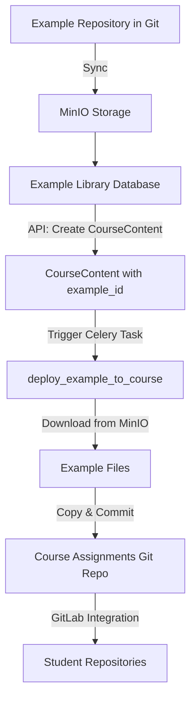

# Example Library Investigation & Discussion

**Date**: 2025-07-20  
**Status**: Investigation Phase  
**Purpose**: Document discussion findings and plan implementation approach

## Overview

This document captures our investigation and discussion about the Example Library system implementation. The goal is to design a robust system for managing reusable programming assignments and examples with MinIO-based versioned storage and a restructured database model.

## Current Context

Based on the GitLab refactoring progress:
- ✅ Example Library database models are complete (`ExampleRepository` and `Example`)
- ✅ Git integration with token-based access is ready
- ✅ Database migration with proper constraints is done
- 🔄 Next priority: Example Repository Synchronization and REST API
- 🆕 New branch: `feature/minio` for versioned storage implementation

## Investigation Findings

### 1. Current Database Models

#### ExampleRepository Model (`/src/ctutor_backend/model/example.py`)
- **Purpose**: Represents a repository containing multiple examples (Git, MinIO, etc.)
- **Key Fields**:
  - `source_type`: Type of source ('git', 'minio', 'github', 's3', 'gitlab')
  - `source_url`: Repository URL (Git URL, MinIO path, etc.)
  - `access_credentials`: Encrypted credentials (Git token, MinIO JSON, etc.)
  - `default_branch`: Branch or version to sync from
  - `visibility`: public, private, or restricted
  - `organization_id`: For organization-owned repositories
- **Storage**: Flat structure - each example in its own directory
- **Flexibility**: Supports multiple repository types via source_type field

#### Example Model
- **Purpose**: Individual example/assignment within a repository
- **Key Fields**:
  - `directory`: Name of the directory (e.g., 'hello-world')
  - `title`, `description`: Metadata
  - `subject`: Programming language
  - `tags`: For searching/filtering
  - `version_identifier`: Hash for change detection
- **Constraint**: Unique example per directory per repository

### 2. Current CourseContent Structure

#### Hierarchical Models
1. **CourseContentKind**: Types like 'unit' or 'assignment'
   - `has_ascendants`: Can have parent content
   - `has_descendants`: Can have child content
   - `submittable`: Whether it can be submitted

2. **CourseContentType**: Course-specific content types
   - Links to specific course
   - Has slug for identification

3. **CourseContent**: Actual content with hierarchy
   - **Uses Ltree**: `path = Column(LtreeType, nullable=False)`
   - Links to CourseContentType
   - Contains submission settings (max_group_size, max_test_runs, etc.)

### 3. Current Meta.yaml Structure

#### Three-Level Hierarchy (from `/src/ctutor_backend/interface/codeability_meta.py`)

1. **CodeAbilityCourseMeta** (Root Level)
   - Defines overall course structure
   - Lists content types and execution backends
   - Course-wide metadata

2. **CodeAbilityUnitMeta** (Unit Level)
   - For organizational units (chapters, modules, weeks)
   - Contains `type` field linking to content type slug

3. **CodeAbilityExampleMeta** (Assignment Level)
   - Most detailed level
   - Properties include:
     - `studentSubmissionFiles`: Files students must submit
     - `additionalFiles`: Additional files provided to students
     - `testFiles`: Test files for automated grading
     - `studentTemplates`: Template files for student projects
     - `executionBackend`: Backend configuration
     - Submission limits (maxTestRuns, maxSubmissions, maxGroupSize)

#### Legacy Field: testDependencies
- Found in `CodeAbilityMeta` (legacy compatibility)
- Type: `Optional[List[str]]`
- Purpose: Handle dependencies between examples (e.g., function from one example used in another)
- **Current approach**: Uses relative paths due to static filesystem positions

### 4. Key Architectural Challenges

#### Current System
- **Tight Coupling**: Git repository filesystem mirrors the unit/assignments Ltree structure
- **Dependency Management**: Uses relative paths in `testDependencies`
- **Rigidity**: Changing tree structure requires changing filesystem

#### Proposed New Approach
- **Linear Storage**: All assignments stored linearly in Git repository
- **Database-Only Hierarchy**: Ltree structure exists only in database
- **Benefits**:
  - Reposition assignments without changing filesystem
  - Examples can be reused across different courses/positions
  - Dependencies can be managed via IDs rather than paths

### 5. MinIO Integration Considerations

With the new `feature/minio` branch:
- **Versioned Storage**: Each example version stored in MinIO
- **Decoupling**: Complete separation of storage from hierarchy
- **Performance**: Fast retrieval of specific versions
- **Scalability**: Better handling of large files and binary content

#### Dual Storage Support
The ExampleRepository now supports multiple sources via the `source_type` field:

```python
# Git-based repository (traditional)
repo1 = ExampleRepository(
    source_type='git',
    source_url='https://gitlab.com/org/examples.git',
    access_credentials='gitlab_token_xxx',
    default_branch='main'
)

# MinIO-based repository (new)
repo2 = ExampleRepository(
    source_type='minio',
    source_url='computor-examples/python-basics',  # bucket/path
    access_credentials='{"access_key": "xxx", "secret_key": "yyy"}',  # JSON
    default_branch='v1.0'  # Version tag
)
```

## Discussion Topics

### 1. Example Library Architecture

**Key Questions**:
- How do we map between linear Git storage and hierarchical course structure?
- Should Examples have a direct relationship with CourseContent?
- How do we handle multiple courses using the same example?

**Proposed Approach**:
- Examples remain independent entities
- CourseContent references Example by ID
- Position and hierarchy managed entirely in CourseContent Ltree

### 2. Dependency Management

**Current Issues**:
- Relative paths break when structure changes
- Hard to track dependencies across repositories
- No version control for dependencies

**Proposed Solution**:
- Replace `testDependencies` paths with Example IDs
- Create explicit `ExampleDependency` table:
  ```sql
  example_id -> depends_id
  # Simplified: No dependency types or version constraints
  # Dependencies always use current version
  ```

### 3. Synchronization Strategy

**Requirements**:
- Sync from Git repositories to database
- Detect changes via version_identifier
- Store files in MinIO with versioning
- Update Example records with metadata

**Workflow**:
1. Clone/pull Git repository
2. Scan directories for meta.yaml files
3. Parse metadata and compare with database
4. Upload changed files to MinIO
5. Update Example records
6. Manage dependencies

### 4. API Design

**Endpoints Needed**:
- Repository management (CRUD)
- Example discovery and search
- Sync triggers and status
- Dependency resolution
- Version management

### 5. Integration Points

**With CourseContent**:
- Link via new field: `example_id`
- Maintain backward compatibility
- Migration strategy for existing content

**With MinIO**:
- Storage structure: `bucket/repository_id/example_id/version/files`
- Metadata storage
- Access control

## Proposed Technical Changes

### 1. Database Schema Modifications

#### CourseContent Model Enhancement
```python
class CourseContent(Base):
    # ... existing fields ...
    
    # New field to link to Example
    example_id = Column(UUID(as_uuid=True), ForeignKey("example.id"), nullable=True)
    example_version = Column(String(64), nullable=True)  # Specific version snapshot
    
    # Relationship
    example = relationship("Example", back_populates="course_contents")
```

#### New ExampleDependency Model (Simplified)
```python
class ExampleDependency(Base):
    __tablename__ = "example_dependency"
    
    id = Column(UUID(as_uuid=True), primary_key=True, server_default=text("uuid_generate_v4()"))
    example_id = Column(UUID(as_uuid=True), ForeignKey("example.id"), nullable=False)
    depends_id = Column(UUID(as_uuid=True), ForeignKey("example.id"), nullable=False)
    created_at = Column(DateTime(timezone=True), nullable=False, server_default=func.now())
    
    # Relationships
    example = relationship("Example", foreign_keys=[example_id], back_populates="dependencies")
    dependency = relationship("Example", foreign_keys=[depends_id])
    
    # Note: Dependencies always refer to the current version of the depended-upon example
    # No version constraints or dependency types - keep it simple
```

### 2. MinIO Storage Structure

```
computor-examples/  # MinIO bucket
├── repositories/
│   └── {repository_id}/
│       └── {example_id}/
│           └── {version_hash}/
│               ├── meta.yaml
│               ├── files/
│               │   ├── main.py
│               │   ├── test_main.py
│               │   └── ...
│               └── metadata.json  # Parsed meta.yaml + computed info
```

### 3. Synchronization Service Architecture

```python
class ExampleSyncService:
    async def sync_repository(self, repository_id: UUID):
        # 1. Clone/pull Git repository
        # 2. Scan for examples (directories with meta.yaml)
        # 3. For each example:
        #    - Parse meta.yaml
        #    - Compute version hash
        #    - Check if changed
        #    - Upload to MinIO
        #    - Update database
        # 4. Resolve dependencies
        # 5. Update repository sync timestamp
```

### 4. Celery Task: Example to Git Repository Deployment

```python
@celery_app.task(name="deploy_example_to_course")
def deploy_example_to_course(
    course_id: UUID,
    course_content_id: UUID,
    example_id: UUID,
    example_version: str,
    target_path: str  # e.g., "week1/hello_world"
):
    """
    Celery task that copies an example from MinIO to the course's Git repository.
    This maintains the current workflow where course content exists in Git.
    """
    # 1. Fetch example metadata from database
    example = get_example(example_id)
    course = get_course(course_id)
    
    # 2. Download files from MinIO
    minio_path = f"repositories/{example.repository_id}/{example_id}/{example_version}/"
    files = download_from_minio(minio_path)
    
    # 3. Clone/pull course assignments repository
    course_repo_path = clone_course_assignments_repo(course)
    
    # 4. Create target directory structure
    target_dir = course_repo_path / target_path
    target_dir.mkdir(parents=True, exist_ok=True)
    
    # 5. Copy files to target location
    for file_path, content in files.items():
        (target_dir / file_path).write_bytes(content)
    
    # 6. Handle dependencies
    if example.dependencies:
        # Copy dependent files or update references
        process_dependencies(example, target_dir)
    
    # 7. Update meta.yaml with course-specific settings
    update_meta_yaml(target_dir, course_content_id)
    
    # 8. Commit and push changes
    commit_message = f"Add {example.title} to {target_path}"
    git_commit_and_push(course_repo_path, commit_message)
    
    # 9. Update CourseContent with deployment status
    update_course_content_status(course_content_id, "deployed")
    
    return {
        "status": "success",
        "example_id": str(example_id),
        "deployed_to": target_path,
        "version": example_version
    }
```

### 5. Complete Workflow: From Example Library to Course



### 6. API Endpoints Design

```
# Repository Management
POST   /api/v1/example-repositories
GET    /api/v1/example-repositories
PUT    /api/v1/example-repositories/{id}
DELETE /api/v1/example-repositories/{id}
POST   /api/v1/example-repositories/{id}/sync

# Example Discovery
GET    /api/v1/examples
GET    /api/v1/examples/{id}
GET    /api/v1/examples/{id}/versions
GET    /api/v1/examples/{id}/dependencies
GET    /api/v1/examples/search?q=python&tags=basics

# Course Content Creation with Examples
POST   /api/v1/courses/{course_id}/content
{
    "title": "Hello World Assignment",
    "path": "week1.hello_world",
    "example_id": "uuid-of-hello-world-example",
    "example_version": "latest",  # or specific hash
    "properties": {
        "maxSubmissions": 5,
        "maxTestRuns": 10
    }
}
Response: {
    "course_content_id": "uuid",
    "deployment_task_id": "celery-task-id"
}

# Deployment Status
GET    /api/v1/courses/{course_id}/content/{content_id}/deployment-status
```

### 7. Version Management & Release Workflow

#### Version Flow
1. **MinIO Examples**: The authoritative versions (tagged releases)
2. **Assignments Repository**: Working copy where lecturers can customize
3. **Student Template**: Generated from assignments repo for student distribution

#### Key Changes to CourseContent
```python
class CourseContent(Base):
    # ... existing fields ...
    
    # Link to Example Library
    example_id = Column(UUID(as_uuid=True), ForeignKey("example.id"), nullable=True)
    example_version = Column(String(64), nullable=True)  # The MinIO version deployed
    
    # Track customizations
    is_customized = Column(Boolean, default=False)  # True if lecturer modified after deployment
    deployed_at = Column(DateTime(timezone=True))  # When example was deployed from MinIO
    
    # Keep existing version_identifier for Git tracking
    version_identifier = Column(String(2048), nullable=False)  # Git commit hash in assignments repo
```

#### Workflow Stages

1. **Example Development & Release**
   ```
   Example Repo → Tag/Release → Sync to MinIO → Available in Library
   ```

2. **Course Deployment**
   ```
   Select Example (v1.0) → Deploy to Assignments Repo → Lecturer Customizes
   ```

3. **Student Distribution**
   ```
   Assignments Repo → Generate Student Template → Students Fork
   ```

#### Version Tracking
- **example_version**: The MinIO version originally deployed (e.g., "v1.0")
- **version_identifier**: Current Git hash in assignments repo (includes customizations)
- **is_customized**: Flag indicating lecturer modifications

### 8. Repository Structure Comparison

#### Current System
```
course-assignments/
├── week1/
│   ├── hello-world/     # Full example inline
│   └── variables/       # Full example inline
└── week2/
    └── functions/       # Full example inline
```

#### New System
```
# Example Library (MinIO)
example-lib/
├── hello-world/
│   ├── v1.0/
│   ├── v1.1/
│   └── v2.0/

# Course Assignments Repo (GitLab)
course-assignments/
├── week1/
│   ├── hello-world/     # Deployed from MinIO v1.0 + lecturer customizations
│   └── variables/       # Deployed from MinIO v1.1
└── week2/
    └── functions/       # Deployed from MinIO v2.0
```

### 9. Key Workflow Differences

#### Current System
- Version control via Git commits in assignments repository
- No separation between original and customized content
- version_identifier tracks repository state at release

#### New System
- **Dual versioning**: MinIO versions (releases) + Git versions (customizations)
- Clear separation between library examples and course-specific customizations
- Can track which version was deployed and whether it was modified
- Lecturers can:
  - Use examples as-is from specific versions
  - Customize after deployment
  - Update to newer versions (with conflict resolution)

## Key Files to Investigate Further

1. `/src/ctutor_backend/model/course.py` - CourseContent model details
2. `/src/ctutor_backend/generator/gitlab_builder.py` - Current structure creation
3. `/src/ctutor_backend/flows/` - Workflow definitions
4. `/defaults/` - Template structures
5. `/src/ctutor_backend/model/example.py` - Example models to enhance

### 10. Student Template Generation

#### Current Process
```
Assignments Repo → Remove test files → Generate Student Template → Students Fork
```

#### New Process with Example Library
```python
@celery_app.task(name="generate_student_template")
def generate_student_template(course_id: UUID):
    """
    Generate student-template repository from assignments repository.
    Considers both MinIO examples and lecturer customizations.
    """
    # 1. Get all CourseContent for the course
    course_contents = get_course_contents(course_id)
    
    # 2. Clone assignments repository
    assignments_repo = clone_assignments_repo(course_id)
    
    # 3. Clone/create student-template repository
    template_repo = clone_or_create_template_repo(course_id)
    
    # 4. For each CourseContent
    for content in course_contents:
        source_path = assignments_repo / content.path
        target_path = template_repo / content.path
        
        # 5. Copy files based on meta.yaml rules
        meta = parse_meta_yaml(source_path)
        
        # Copy student files
        copy_student_files(source_path, target_path, meta.studentTemplates)
        
        # Exclude test files and solutions
        exclude_files(target_path, meta.testFiles)
        
        # 6. Update meta.yaml for student version
        update_student_meta(target_path, content)
    
    # 7. Commit and push
    commit_message = f"Update student template for {course.title}"
    git_commit_and_push(template_repo, commit_message)
```

### 11. Example Update Workflow

When a new version of an example is available:

1. **Notification**: System notifies lecturer of new version
2. **Comparison**: Show diff between current (customized) and new version
3. **Options**:
   - **Keep current**: No action, stay with customized version
   - **Update**: Deploy new version (overwrites customizations)
   - **Merge**: Three-way merge between original, customized, and new version

```python
@celery_app.task(name="update_example_version")
def update_example_version(
    course_content_id: UUID,
    new_version: str,
    merge_strategy: str = "overwrite"  # or "merge"
):
    """Update CourseContent to new example version."""
    # Implementation details...
```

## Test Case Scenario: Building a New Course

### Goal
Build a new course with a complete CourseContent structure where assignments are initialized from the Example Library. If this works seamlessly, we have successfully decoupled storage from hierarchy!

### Deployment Configuration

Using `ComputorDeploymentConfig` from `/src/ctutor_backend/interface/deployments.py`:

```yaml
# deployment.yaml
organization:
  path: "test-org"
  name: "Test Organization"
  description: "Organization for Example Library testing"
  gitlab:
    url: "https://gitlab.example.com"
    token: "xxx"
    parent: 0

courseFamily:
  path: "programming"
  name: "Programming Courses"
  description: "Introductory programming course family"

course:
  path: "python-101"
  name: "Introduction to Python"
  description: "Basic Python programming course"
  executionBackends:
    - slug: "python-docker"
      settings:
        image: "python:3.10"
  settings:
    source:
      url: "https://gitlab.example.com/test-org/programming/python-101/assignments.git"
      token: "xxx"
```

### Test Scenario Steps

1. **Converter Output (Linearized Examples)**
   ```
   converted-examples/
   ├── hello-world/
   │   ├── meta.yaml
   │   ├── main.py
   │   └── test_main.py
   ├── variables-basics/
   │   ├── meta.yaml
   │   ├── variables.py
   │   └── test_variables.py
   └── functions-intro/
       ├── meta.yaml
       ├── functions.py
       ├── test_functions.py
       └── dependencies: [variables-basics]  # Uses variables from previous example
   ```

2. **Sync to Example Library**
   - Import linearized examples into Example Library
   - Store in MinIO with version tags
   - Track dependencies by ID

3. **Course Structure Definition** (separate from deployment.yaml)
   ```yaml
   # course-structure.yaml
   contentTypes:
     - kind: "unit"
       slug: "week"
       title: "Week"
       color: "#4CAF50"
     - kind: "assignment"
       slug: "assignment"
       title: "Assignment"
       color: "#2196F3"
   
   structure:
     - path: "week1"
       type: "week"
       title: "Week 1: Introduction"
       content:
         - path: "week1.hello_world"
           type: "assignment"
           title: "Hello World"
           example_id: "{{hello-world-uuid}}"
           example_version: "v1.0"
         - path: "week1.variables"
           type: "assignment"
           title: "Variables Basics"
           example_id: "{{variables-basics-uuid}}"
           example_version: "v1.0"
     - path: "week2"
       type: "week"
       title: "Week 2: Functions"
       content:
         - path: "week2.functions"
           type: "assignment"
           title: "Function Basics"
           example_id: "{{functions-intro-uuid}}"
           example_version: "v1.0"
   ```

4. **Deployment Process**
   ```python
   # 1. Create organization/family/course hierarchy
   deploy_course(ComputorDeploymentConfig.from_yaml("deployment.yaml"))
   
   # 2. Create course content structure with examples
   create_course_content_from_structure("course-structure.yaml")
   
   # 3. Trigger Celery tasks to deploy examples to assignments repo
   deploy_examples_to_course(course_id)
   ```

5. **Expected Result**
   - **Database**: CourseContent with Ltree paths (week1.hello_world, etc.)
   - **MinIO**: Examples stored with versions
   - **GitLab**: Assignments repo with deployed examples
   - **Dependencies**: Resolved and copied correctly
   - **Reusability**: Same examples available for other courses

### Success Criteria

1. **Decoupling Verified**:
   - ✅ Examples stored linearly in Git/MinIO
   - ✅ Course hierarchy only in database (Ltree)
   - ✅ No filesystem reorganization needed

2. **Dependency Management**:
   - ✅ `functions-intro` correctly references `variables-basics` by ID
   - ✅ Dependencies work regardless of course structure
   - ✅ Version constraints respected

3. **Reusability**:
   - ✅ Same `hello-world` example used in multiple courses
   - ✅ Different positions in different course hierarchies
   - ✅ No duplication of example content

4. **API Operations**:
   - ✅ Create course with examples via API
   - ✅ Reposition content without breaking dependencies
   - ✅ Update example versions independently

## Implementation Plan

### Phase 1: Database Schema Updates
1. Add `example_id` to CourseContent model
2. Create simplified ExampleDependency table (example_id, depends_id)
3. Update relationships and constraints

### Phase 2: MinIO Integration
1. Implement storage service
2. Version management system
3. File retrieval APIs

### Phase 3: Synchronization Service
1. Git repository scanner
2. Meta.yaml parser with dependency resolution
3. MinIO uploader with versioning

### Phase 4: API Development
1. Repository management endpoints
2. Example search and discovery
3. Course content creation with examples

### Phase 5: Test Case Implementation
1. Create sample repository
2. Build test course
3. Validate all success criteria

## Next Steps
- Finalize database schema changes
- Design MinIO storage structure
- Implement synchronization service
- Create API endpoints
- Execute test case