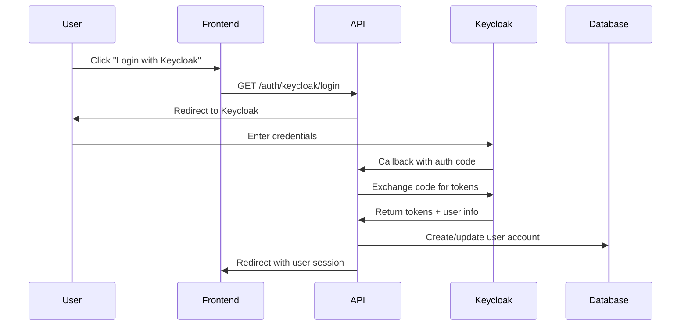

# Keycloak SSO Integration Guide

## Overview

Computor now supports Single Sign-On (SSO) authentication through Keycloak, an open-source identity and access management solution. This integration provides:

- OpenID Connect (OIDC) authentication
- Centralized user management
- Support for external identity providers
- User registration and account linking
- Automatic admin user provisioning

## Architecture

### Components

1. **Keycloak Service**: Runs as a Docker container with its own PostgreSQL database
2. **Authentication Plugin**: Modular plugin system for multiple auth providers
3. **SSO API Endpoints**: RESTful endpoints for authentication flows
4. **Admin Client**: Keycloak admin API client for user management

### Authentication Flow



## Configuration

### Environment Variables

Add these to your `.env` file:

```bash
# Keycloak Configuration
KEYCLOAK_ADMIN=admin
KEYCLOAK_ADMIN_PASSWORD=admin_password
KEYCLOAK_DB_PASSWORD=keycloak_secret
KEYCLOAK_SERVER_URL=http://localhost:8180
KEYCLOAK_REALM=computor
KEYCLOAK_CLIENT_ID=computor-backend
KEYCLOAK_CLIENT_SECRET=computor-backend-secret
```

### Docker Services

The `docker-compose-dev.yaml` includes:

```yaml
keycloak-db:
  image: postgres:16
  environment:
    POSTGRES_USER: keycloak
    POSTGRES_PASSWORD: ${KEYCLOAK_DB_PASSWORD}
    POSTGRES_DB: keycloak

keycloak:
  image: quay.io/keycloak/keycloak:latest
  command: start-dev --import-realm
  environment:
    KC_DB: postgres
    KC_DB_URL: jdbc:postgresql://keycloak-db:5432/keycloak
    KEYCLOAK_ADMIN: ${KEYCLOAK_ADMIN}
    KEYCLOAK_ADMIN_PASSWORD: ${KEYCLOAK_ADMIN_PASSWORD}
  volumes:
    - ./data/keycloak:/opt/keycloak/data/import
```

## API Endpoints

### Authentication Endpoints

- `GET /auth/providers` - List available authentication providers
- `GET /auth/{provider}/login` - Initiate login flow
- `GET /auth/{provider}/callback` - Handle OAuth callback
- `POST /auth/{provider}/logout` - Logout from provider

### User Registration

- `POST /auth/register` - Register new user

Example request:
```json
{
  "username": "newuser",
  "email": "user@example.com",
  "password": "SecurePassword123!",
  "given_name": "John",
  "family_name": "Doe",
  "provider": "keycloak",
  "send_verification_email": true
}
```

### Admin Endpoints

- `GET /auth/admin/plugins` - List all plugins (admin only)
- `POST /auth/admin/plugins/{name}/enable` - Enable plugin
- `POST /auth/admin/plugins/{name}/disable` - Disable plugin

## User Management

### Admin User Sync

The system automatically syncs the admin user with Keycloak during initialization:

```bash
bash initialize_system.sh
```

This creates the admin user in both the local database and Keycloak, using credentials from environment variables:
- Username: `EXECUTION_BACKEND_API_USER` (default: admin)
- Password: `EXECUTION_BACKEND_API_PASSWORD` (default: admin)

### Default Users

The Keycloak realm includes demo users for testing:

| Username | Password | Description |
|----------|----------|-------------|
| admin | admin | System administrator (synced) |
| demo_user | password | Regular user |
| demo_admin | password | Admin user |

## Plugin Development

### Creating a New Auth Provider

1. Create a new plugin class inheriting from `AuthenticationPlugin`:

```python
from ctutor_backend.plugins.base import AuthenticationPlugin, PluginMetadata, AuthenticationType

class MyAuthPlugin(AuthenticationPlugin):
    @property
    def metadata(self) -> PluginMetadata:
        return PluginMetadata(
            name="myauth",
            version="1.0.0",
            description="My authentication provider",
            provider_name="My Auth",
            provider_type=AuthenticationType.OAUTH2
        )
    
    def get_login_url(self, redirect_uri: str, state: str) -> str:
        # Return OAuth authorization URL
        pass
    
    async def handle_callback(self, code: str, state: str, redirect_uri: str) -> AuthResult:
        # Handle OAuth callback
        pass
```

2. Place the plugin in the plugins directory
3. Enable it through the API or configuration

## Security Considerations

1. **Client Secret**: Always use strong, unique client secrets in production
2. **HTTPS**: Enable HTTPS for all authentication flows in production
3. **Token Storage**: Tokens are stored in Redis with appropriate TTL
4. **CSRF Protection**: State parameter prevents CSRF attacks
5. **JWT Verification**: All ID tokens are verified using JWKS

## Troubleshooting

### Common Issues

1. **401 Unauthorized**: Check client credentials in `.env` match Keycloak configuration
2. **Network Timeouts**: Ensure Keycloak service is running and accessible
3. **JWT Verification Errors**: Plugin automatically skips at_hash verification for compatibility
4. **Database Errors**: Ensure PostgreSQL is running on the correct port

### Debug Mode

Enable debug logging in the Keycloak plugin:
```python
logger.setLevel(logging.DEBUG)
```

### Testing Authentication

1. Start all services:
```bash
docker-compose -f docker-compose-dev.yaml up -d
bash api.sh
```

2. Navigate to: `http://localhost:8000/auth/keycloak/login`
3. Login with demo credentials
4. Check logs for any errors

## Future Enhancements

- Group/role mapping from Keycloak claims
- Support for additional providers (GitLab, GitHub, Google)
- Multi-factor authentication
- User profile synchronization
- SAML support