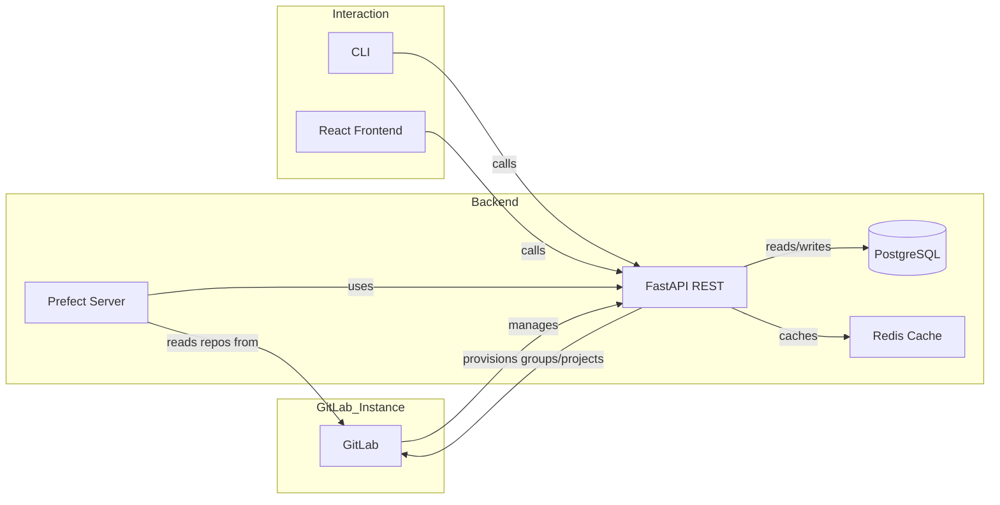
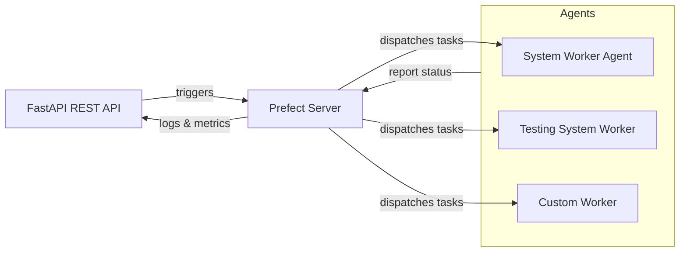

## System Concepts & Architecture Overview

This document provides a high-level conceptual explanation of how the system is structured, its core components, and how they interact.

---

### 1. System Components

| Component                             | Description                                                                                                    |
| ------------------------------------- | -------------------------------------------------------------------------------------------------------------- |
| **FastAPI Backend**                   | Serves RESTful APIs for deployment, configuration, and runtime operations. Supports hot reload in development. |
| **PostgreSQL Database**               | Stores metadata: organizations, courses, users, deployments, assignments, and more.                            |
| **Alembic**                           | Manages schema migrations to evolve the database structure over time.                                          |
| **Redis Cache**                       | Used for caching task results, session data, and speeding up frequently accessed data.                         |
| **Prefect Orchestrator**              | Executes long-running background tasks (e.g., sync repositories, process submissions).                         |
| **CLI** | Command-line interface to deploy entities, apply configurations, and manage course lifecycle.                  |
| **Visual Studio Code Extension**      | Integrates with the CLI and API to provide in-editor assignment browsing and feedback.                         |

#### 1.1 Architecture Diagram

Below is a high-level architecture diagram illustrating interactions between components and GitLab instances:

---

#### 1.2 Prefect Server & Workers Diagram

Below is a diagram illustrating the Prefect server component interacting with FastAPI and various agents (workers):

---

### 2. Key Entities

* **Organization**: Top-level GitLab group containing one or more `CourseFamily` groups.
* **CourseFamily**: Sub-group within an organization, used to group related courses (e.g., by subject or department).
* **Course**: GitLab project under a `CourseFamily`, encapsulating a single course offering.
* **CourseContent (Units & Assignments)**: Represented as a hierarchical tree in the database using PostgreSQL's `ltree` extension. These follow the same nested folder structure as in the assignment repository (units for modules/weeks and assignments for individual tasks).
* **CourseMember**: A user’s role (e.g., student, instructor) within a specific course.

---

### 3. Deployment Workflow

1. **Define Entities**: Create a YAML deployment file specifying `organization`, `courseFamily`, and `course` attributes (names, paths, GitLab settings).
2. **Run CLI Deploy**: Execute `computor deploy --file <file>.yaml`. The CLI:

   * Communicates with the FastAPI backend.
   * Creates GitLab groups and projects via GitLab API.
   * Writes entity metadata to the database.
3. **Register Descendants** (optional): Use `-d true` to register course contents (units and assignments) in the database in one step.
4. **Apply Updates**: Later modifications can be applied via `computor apply ...` or through the API directly.

---

### 4. Runtime Operations

* **Repository Sync**: Prefect tasks clone or update assignment repositories according to configured source URLs and tokens.
* **Submission Processing**: Student submissions are pulled, processed, and results cached in Redis or stored in PostgreSQL.
* **User & Membership Management**: Import `CourseMember` data via CSV to auto-create users, link GitLab accounts, and assign roles.
* **Feedback Loop**: Instructors can view and comment on student code via the VSCode extension or web UI.

---

### 5. Scaling & Environments

* **Development Mode**: Uses `docker-compose-dev.yaml`, hot-reload backend, local Postgres and Redis instances for rapid iteration.
* **Production Mode**: Single script `startup_prod.sh` provisions services, applies migrations, and runs containers without hot-reload.
* **Infrastructure**:

  * Docker containers isolate backend, database, cache, and Prefect agent.
  * `SYSTEM_DEPLOYMENT_PATH` centralizes persistent data across environments.

---

### 6. Security & Tokens

* **Admin Credentials**: Set via environment variables (`EXECUTION_BACKEND_API_USER` / `PASSWORD`).
* **GitLab Tokens**: Each organization and source repository requires an access token with appropriate scopes.
* **Personal Access Tokens**: Used by individuals (via CLI or VSCode) to authenticate against the GitLab instance.

---

### 7. Assignment Repository Structure & Content

Each course’s assignments are stored in a Git repository that mirrors the internal `CourseContent` hierarchy. The repository includes:

* **Folder Structure**: Units (modules/weeks) and assignments are represented as nested directories.
* **Markdown Files**: Contain problem statements, examples, and instructions for each assignment.
* **`test.yaml`**: Specifies test cases and instructions for the configured testing backend.
* **`meta.yaml`**: Stores metadata such as author, creation date, and the designated testing backend for each assignment.
* **`reference` Repository**: Contains the full solutions. These repositories are private and used by teaching assistants for grading and reference.
* **`student-template` Repository**: Built via a system release (Prefect), this template includes the directory structure and initial files (often empty or with starter code) for students.

  * Student repositories in the `students` subgroup are forks of this template. Students work in their forks, preserving a clean origin template.

This structure ensures consistency between the file system, database `ltree` paths, and GitLab organization.

---

This overview should help you understand the foundational concepts and how the pieces fit together before diving into detailed setup and usage guides. Feel free to refer back to this document as you explore the system.

### 8. Frontend React UI

A new **React-based UI** is under development to eventually replace the CLI for most operations. Key characteristics:

* **Frontend-only**: No embedded backend; communicates solely via HTTP.
* **REST & Custom APIs**: Uses the FastAPI service’s REST endpoints and any custom APIs exposed by the backend.
* **Feature Parity Goal**: Aims to support entity deployments, course navigation, assignment browsing, member management, and more, all within a web interface.
* **In Progress**: Current milestones include authentication flows, dashboard views, and basic entity CRUD operations.

This UI will provide a more user-friendly experience for administrators, instructors, and students alike, complementing or replacing CLI workflows in the future.

---

This overview should help you understand the foundational concepts and how the pieces fit together before diving into detailed setup and usage guides. Feel free to refer back to this document as you explore the system.

---

_This documentation was initially generated with the assistance of OpenAI's ChatGPT and adapted to match the specific structure, workflows, and conventions of this project. Final edits and additions were made to reflect the actual system design and usage._
