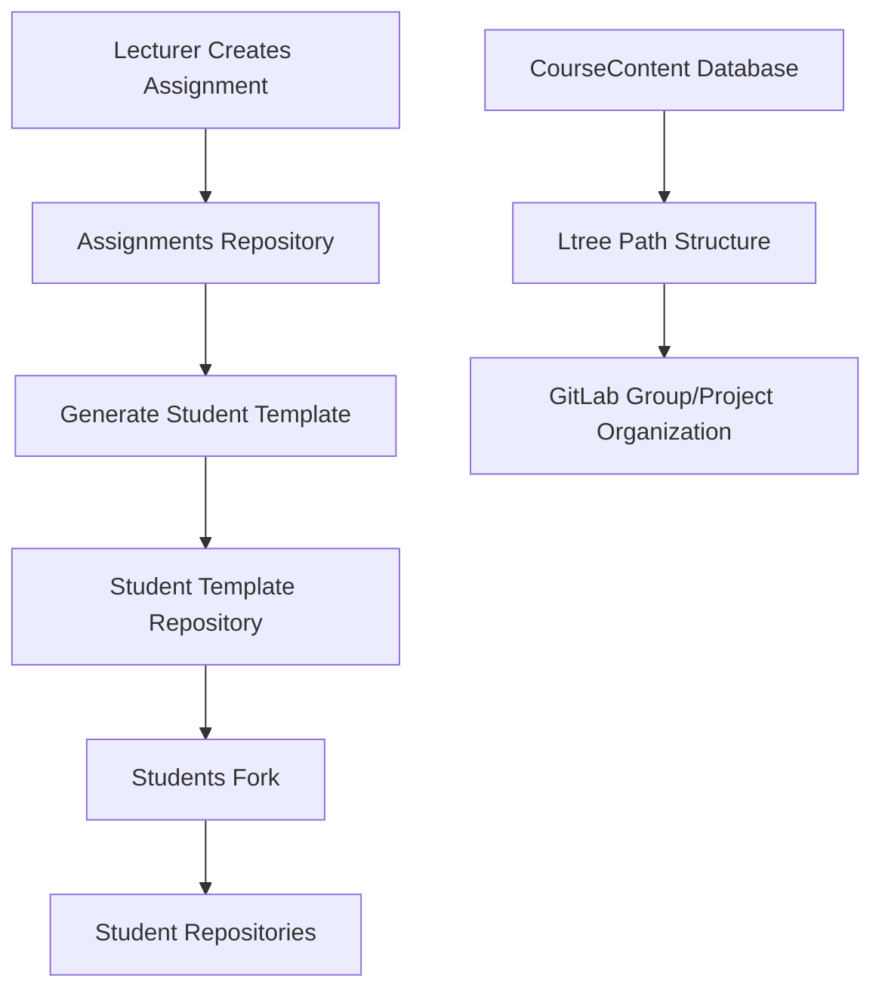
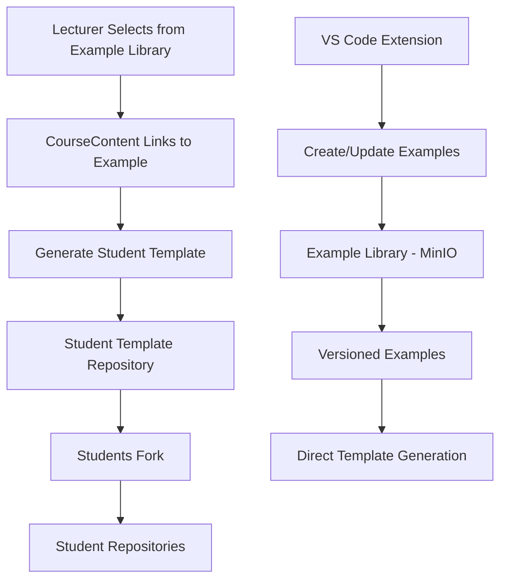
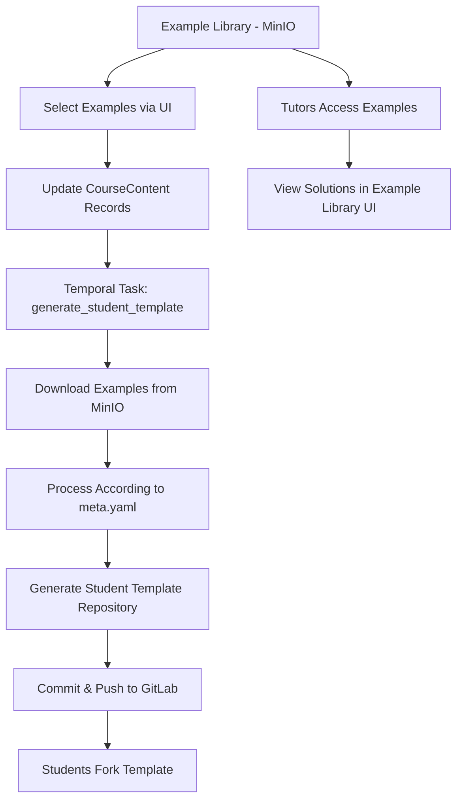

# Example Deployment Strategy

**Date**: 2025-07-31  
**Status**: ✅ COMPLETED - Implementation Finished  
**Purpose**: System for deploying examples from Example Library to course Git repositories

## Overview

This document outlines the strategy for bridging the Example Library system with the existing Git-based course workflow. The goal is to enable lecturers to select examples from the library and automatically deploy them to course repositories while maintaining the current student workflow.

**Important Architecture Update (2025-07-31)**: After analysis of the new Example Library paradigm, we've determined that the traditional "assignments" repository is no longer necessary. Examples are now first-class entities that can be versioned and managed independently, eliminating the need for an intermediate storage repository.

## Current Architecture Analysis

### Repository Structure Evolution

#### Old System (Pre-Example Library)
The traditional system used three Git repositories per course:

1. **Assignments Repository** (`{course-path}-assignments.git`)
   - Contains reference solutions and test files
   - Lecturer's working repository
   - Source for generating student templates
   - **Problem**: Tight coupling between content creation and course structure

2. **Student Template Repository** (`{course-path}-student-template.git`)
   - Generated from assignments repository
   - Contains skeleton code and instructions
   - Students fork this repository

3. **Reference Repository** (`{course-path}-reference.git`)
   - Contains canonical solutions for tutors
   - Generated from assignments repository

#### New System (With Example Library)
The Example Library paradigm eliminates the need for both assignments and reference repositories:

1. **Example Library (MinIO Storage)**
   - Centralized, versioned storage of all examples
   - Examples are first-class entities with metadata
   - Contains both skeleton code AND full solutions
   - Independent of any specific course
   - Supports versioning and dependency management

2. **Student Template Repository** (`{course-path}-student-template.git`)
   - Generated directly from Example Library selections
   - Contains skeleton code and instructions
   - Students fork this repository
   - **Key Change**: No intermediate repositories needed

**Note**: The reference repository is also obsolete because:
- Full solutions are stored in the Example Library
- Tutors can access examples directly via the UI or API
- Version control is handled at the example level, not course level

### Course Content Flow Comparison

#### Old Flow (With Assignments Repository)


#### New Flow (Direct from Example Library)


## Revised Integration Strategy

### Why Assignments and Reference Repositories are No Longer Needed

1. **Examples are First-Class Entities**
   - Stored in MinIO with full versioning
   - Contains BOTH student templates AND reference solutions
   - Independent of any specific course
   - Can be updated without affecting course repositories

2. **Direct Template Generation**
   - Student templates generated directly from Example Library
   - Reference solutions accessible directly from Example Library
   - No need for intermediate storage in Git
   - CourseContent table maintains the link between course and examples

3. **Lecturer and Tutor Workflow Simplified**
   - Create/edit examples via VS Code extension or API
   - Select examples for course via UI
   - Student template automatically generated
   - Tutors access solutions directly from Example Library UI

4. **Version Management**
   - Example versions managed in Example Library
   - Both templates and solutions versioned together
   - Courses can pin to specific versions or track "latest"
   - No Git history pollution with content updates

### New Deployment Workflow



### Key Components

#### 1. Example Selection Interface
- **Location**: Course Detail Page (`/admin/courses/{id}`)
- **Integration**: Extend existing course content management
- **Features**:
  - Browse Example Library from course content creation
  - Select specific example versions
  - Preview example metadata and dependencies
  - Assign to specific CourseContent path

#### 2. Template Generation System
- **Technology**: Temporal.io workflow (consistent with existing system)
- **Task Name**: `generate_student_template_with_examples`
- **Inputs**: course_id
- **Process**: 
  - Reads CourseContent records with example_id references
  - Downloads examples directly from MinIO
  - Generates student template without intermediate repository

#### 3. Repository Integration Points
- **CourseContent Model**: Links courses to examples via example_id and example_version
- **Student Template Repository**: Generated directly from Example Library content
- **Example Library Access**: Tutors and lecturers access full solutions directly

## Detailed Technical Design

### Enhanced CourseContent Model

```python
class CourseContent(Base):
    # ... existing fields ...
    
    # Example Library Integration
    example_id = Column(UUID(as_uuid=True), ForeignKey("example.id"), nullable=True)
    example_version = Column(String(64), nullable=True)  # e.g., "v1.0", "latest"
    
    # Deployment Tracking
    deployed_at = Column(DateTime(timezone=True), nullable=True)
    deployment_status = Column(String(32), default="pending")  # pending, deploying, deployed, failed
    deployment_task_id = Column(String(128), nullable=True)  # Temporal workflow ID
    
    # Customization Tracking
    is_customized = Column(Boolean, default=False)  # True if modified after deployment
    last_customized_at = Column(DateTime(timezone=True), nullable=True)
    
    # Relationships
    example = relationship("Example", back_populates="course_contents")
```

### Temporal Workflow: `generate_student_template_with_examples`

```python
@workflow.defn
class GenerateStudentTemplateWorkflow:
    @workflow.run
    async def run(self, params: GenerateTemplateParams) -> GenerateTemplateResult:
        """
        Generate student template repository directly from Example Library.
        
        This workflow replaces the old approach of:
        1. Deploy to assignments repo
        2. Generate template from assignments
        
        With a direct approach:
        1. Read CourseContent with example_id references
        2. Download examples from MinIO
        3. Generate template directly
        
        Args:
            course_id: Target course UUID
        
        Returns:
            GenerateTemplateResult with success/failure details
        """
        
        # Step 1: Get all CourseContent with example references
        course_contents = await workflow.execute_activity(
            get_course_contents_with_examples,
            params.course_id,
            start_to_close_timeout=timedelta(minutes=2)
        )
        
        # Step 2: Download examples from MinIO
        download_result = await workflow.execute_activity(
            download_examples_for_template,
            course_contents,
            start_to_close_timeout=timedelta(minutes=10)
        )
        
        # Step 3: Clone/create student template repository
        repo_result = await workflow.execute_activity(
            prepare_student_template_repository,
            params.course_id,
            start_to_close_timeout=timedelta(minutes=5)
        )
        
        # Step 4: Process each CourseContent
        for content in course_contents:
            if content.example_id:
                # Process example-based content
                await workflow.execute_activity(
                    process_example_for_template,
                    ProcessExampleParams(
                        content=content,
                        example_data=download_result.examples[content.example_id],
                        repository_path=repo_result.local_path
                    ),
                    start_to_close_timeout=timedelta(minutes=3)
                )
            else:
                # Handle legacy content (if any)
                await workflow.execute_activity(
                    process_legacy_content,
                    content,
                    start_to_close_timeout=timedelta(minutes=3)
                )
        
        # Step 5: Generate course-level files (README, etc.)
        await workflow.execute_activity(
            generate_course_files,
            GenerateCourseFilesParams(
                course_id=params.course_id,
                repository_path=repo_result.local_path,
                content_count=len(course_contents)
            ),
            start_to_close_timeout=timedelta(minutes=2)
        )
        
        # Step 6: Commit and push changes
        commit_result = await workflow.execute_activity(
            commit_and_push_template,
            CommitTemplateParams(
                repository_path=repo_result.local_path,
                commit_message=f"Update student template from Example Library"
            ),
            start_to_close_timeout=timedelta(minutes=5)
        )
        
        return GenerateTemplateResult(
            success=True,
            commit_hash=commit_result.commit_hash,
            processed_contents=len(course_contents)
        )
```

### Simplified Activity Implementations

Since we're no longer deploying to intermediate repositories, the activities are much simpler:

#### `download_example_from_minio`

```python
@activity.defn
async def download_examples_from_library(
    deployments: List[ExampleDeployment]
) -> DownloadExamplesResult:
    """
    Download example files and metadata from MinIO storage.
    
    Returns:
        DownloadExamplesResult containing files and metadata for each example
    """
    
    examples_data = {}
    metadata_data = {}
    
    for deployment in deployments:
        try:
            # Get example metadata from database
            example = await get_example_by_id(deployment.example_id)
            if not example:
                raise ValueError(f"Example {deployment.example_id} not found")
            
            # Determine version to download
            version = deployment.example_version
            if version == "latest":
                version = await get_latest_example_version(deployment.example_id)
            
            # Download files from MinIO
            storage_path = f"repositories/{example.repository_id}/{deployment.example_id}/{version}/"
            files = await download_from_minio(storage_path)
            
            # Parse metadata
            metadata = None
            if 'meta.yaml' in files:
                metadata = yaml.safe_load(files['meta.yaml'])
            
            examples_data[deployment.example_id] = files
            metadata_data[deployment.example_id] = metadata
            
        except Exception as e:
            logger.error(f"Failed to download example {deployment.example_id}: {e}")
            raise
    
    return DownloadExamplesResult(
        examples=examples_data,
        metadata=metadata_data
    )
```

#### `deploy_single_example`

```python
@activity.defn
async def deploy_single_example(
    params: DeploySingleExampleParams
) -> DeploySingleExampleResult:
    """
    Deploy a single example to the assignments repository at the specified path.
    
    Args:
        params: Deployment parameters including files, target path, and metadata
        
    Returns:
        DeploySingleExampleResult with deployment status and details
    """
    
    try:
        # Create target directory structure based on Ltree path
        target_dir = Path(params.repository_path) / params.target_path.replace('.', '/')
        target_dir.mkdir(parents=True, exist_ok=True)
        
        # Copy example files to target directory
        for filename, content in params.example_files.items():
            if filename == 'metadata.json':  # Skip internal metadata
                continue
                
            target_file = target_dir / filename
            
            # Ensure subdirectories exist
            target_file.parent.mkdir(parents=True, exist_ok=True)
            
            # Write file content
            if isinstance(content, str):
                target_file.write_text(content, encoding='utf-8')
            else:
                target_file.write_bytes(content)
        
        # Update meta.yaml with course-specific settings
        if params.example_metadata:
            await update_meta_yaml_for_course(
                target_dir / 'meta.yaml',
                params.course_content_id,
                params.example_metadata
            )
        
        # Create .example-library file for tracking
        tracking_file = target_dir / '.example-library'
        tracking_data = {
            'example_id': str(params.example_id),
            'example_version': params.example_version,
            'deployed_at': datetime.utcnow().isoformat(),
            'course_content_id': str(params.course_content_id)
        }
        tracking_file.write_text(json.dumps(tracking_data, indent=2))
        
        return DeploySingleExampleResult(
            success=True,
            example_id=params.example_id,
            target_path=params.target_path,
            files_deployed=list(params.example_files.keys()),
            deployment_metadata=tracking_data
        )
        
    except Exception as e:
        logger.error(f"Failed to deploy example {params.example_id} to {params.target_path}: {e}")
        return DeploySingleExampleResult(
            success=False,
            example_id=params.example_id,
            target_path=params.target_path,
            error=str(e)
        )
```

#### `resolve_example_dependencies`

```python
@activity.defn
async def resolve_example_dependencies(
    params: ResolveDependenciesParams
) -> ResolveDependenciesResult:
    """
    Handle dependencies between deployed examples.
    
    This includes:
    - Updating import paths in dependent examples
    - Copying shared utility files
    - Updating meta.yaml testDependencies with new paths
    """
    
    dependency_updates = []
    
    for deployment in params.deployments:
        if not deployment.success:
            continue
            
        try:
            # Get example dependencies from database
            dependencies = await get_example_dependencies(deployment.example_id)
            
            if not dependencies:
                continue
            
            # Find where dependencies were deployed in this course
            dependency_paths = {}
            for dep in dependencies:
                dep_deployment = next(
                    (d for d in params.deployments if d.example_id == dep.depends_id),
                    None
                )
                if dep_deployment and dep_deployment.success:
                    dependency_paths[dep.depends_id] = dep_deployment.target_path
            
            # Update dependency references in deployed files
            if dependency_paths:
                await update_dependency_references(
                    params.repository_path,
                    deployment.target_path,
                    dependency_paths
                )
                
                dependency_updates.append({
                    'example_id': deployment.example_id,
                    'target_path': deployment.target_path,
                    'dependencies_updated': list(dependency_paths.keys())
                })
        
        except Exception as e:
            logger.error(f"Failed to resolve dependencies for {deployment.example_id}: {e}")
            # Continue with other deployments
    
    return ResolveDependenciesResult(
        success=True,
        dependency_updates=dependency_updates
    )
```

### Repository Structure Comparison

#### Old Structure (With Assignments Repository)
```
course-assignments/                  # Intermediate repository (NO LONGER NEEDED)
├── week1/
│   ├── hello_world/
│   │   ├── meta.yaml
│   │   ├── main.py
│   │   ├── test_main.py
│   │   └── README.md
│   └── variables/
│       ├── meta.yaml
│       ├── variables.py
│       └── test_variables.py
└── week2/
    └── functions/
        ├── meta.yaml
        ├── functions.py
        └── test_functions.py

student-template/                    # Generated FROM assignments
├── week1/
│   ├── hello_world/
│   │   ├── main.py                  # Skeleton only
│   │   └── README.md
│   └── variables/
│       └── variables.py             # Skeleton only
└── week2/
    └── functions/
        └── functions.py             # Skeleton only
```

#### New Structure (Direct from Example Library)
```
Example Library (MinIO)              # Source of truth for EVERYTHING
├── examples/
│   ├── hello-world-v1.0/
│   │   ├── meta.yaml               # Defines student/solution files
│   │   ├── main.py                 # Solution code
│   │   ├── main_template.py        # Student template
│   │   ├── test_main.py            # Tests (for grading)
│   │   └── README.md               # Instructions
│   ├── variables-v2.1/
│   └── functions-v1.5/

CourseContent Table                  # Links course to examples
├── course_id: uuid
├── path: "week1.hello_world"
├── example_id: uuid
└── example_version: "v1.0"

student-template/                    # ONLY repository needed
├── week1/
│   ├── hello_world/
│   │   ├── main.py                  # From main_template.py
│   │   └── README.md                # From Example Library
│   └── variables/
│       └── variables.py             # From template file
└── week2/
    └── functions/
        └── functions.py             # From template file

NO assignments repository            # Not needed!
NO reference repository              # Solutions in Example Library!
```

### Example Library Tracking Files

#### `.example-library` (per deployment)
```json
{
  "example_id": "550e8400-e29b-41d4-a716-446655440000",
  "example_version": "v1.2",
  "deployed_at": "2025-07-30T14:30:00Z",
  "course_content_id": "123e4567-e89b-12d3-a456-426614174000",
  "original_directory": "hello-world",
  "dependencies": [
    {
      "example_id": "550e8400-e29b-41d4-a716-446655440001",
      "deployed_path": "week1.variables"
    }
  ]
}
```

#### `deployed-examples.json` (course-wide)
```json
{
  "last_updated": "2025-07-30T14:30:00Z",
  "course_id": "789e4567-e89b-12d3-a456-426614174000",
  "deployments": [
    {
      "course_content_id": "123e4567-e89b-12d3-a456-426614174000",
      "ltree_path": "week1.hello_world",
      "filesystem_path": "week1/hello_world",
      "example_id": "550e8400-e29b-41d4-a716-446655440000",
      "example_version": "v1.2",
      "deployed_at": "2025-07-30T14:30:00Z",
      "is_customized": false
    }
  ]
}
```

## User Interface Integration

### Two-Step Process: Assignment and Release

The UI implements a clear separation between content planning and deployment:

1. **Step 1: Assign Examples to CourseContent (Database Only)**
   - In Course Detail Page, add/edit CourseContent
   - Select examples from Example Library
   - Assign to specific paths (e.g., `week1.hello_world`)
   - This ONLY updates database records (CourseContent.example_id)
   - NO Git operations occur at this stage
   - Multiple examples can be assigned/updated before release

2. **Step 2: Release Student Template (Git Operations)**
   - Separate "Generate Student Template" button
   - Shows summary of pending changes:
     - New examples to be added
     - Existing content to be updated
     - Removed content
   - Confirmation dialog before proceeding
   - Triggers Temporal workflow to:
     - Download examples from MinIO
     - Process according to meta.yaml
     - Generate student-template repository
     - Commit and push changes

### Course Content Management Enhancement

#### Example Selection Dialog
- **Trigger**: "Add Content" or "Edit Content" with "Use Example" option
- **Features**:
  - Browse Example Library with search and filtering
  - Version selection dropdown (latest, v1.0, v1.1, etc.)
  - Dependency visualization
  - Preview example metadata and file structure
  - Conflict detection (if path already exists)

#### Assignment Status Tracking
- **Location**: Course Detail Page content tree
- **Visual Indicators**:
  - 📎 Example Assigned (database only, not in Git yet)
  - ✅ Released (in student-template repository)
  - 🔄 Pending Release (assigned but not released)
  - 🆕 New Version Available (newer example version exists)
  - ⚠️ Modified (content differs from last release)

#### Release Button States
- **"Generate Student Template"** - Active when pending changes exist
- **"Template Up to Date"** - Disabled when no changes pending
- **"Release in Progress..."** - During Temporal workflow execution

#### UI Components

```typescript
// Course Detail Page Actions
<Stack direction="row" spacing={2}>
  <Button
    variant="contained"
    startIcon={<AddIcon />}
    onClick={() => setAddContentOpen(true)}
  >
    Add Content
  </Button>
  
  <Button
    variant="contained"
    color="secondary"
    startIcon={<PublishIcon />}
    onClick={() => setReleaseTemplateOpen(true)}
    disabled={!hasPendingChanges}
  >
    Generate Student Template
  </Button>
  
  {pendingChangesCount > 0 && (
    <Chip
      label={`${pendingChangesCount} pending changes`}
      color="warning"
      size="small"
    />
  )}
</Stack>

// Release Template Dialog
<ReleaseTemplateDialog
  open={releaseTemplateOpen}
  onClose={() => setReleaseTemplateOpen(false)}
  courseId={course.id}
  pendingChanges={calculatePendingChanges()}
  onReleaseStarted={handleReleaseStarted}
/>
```

#### Release Dialog Content

```typescript
interface PendingChange {
  type: 'new' | 'update' | 'remove';
  contentPath: string;
  exampleName?: string;
  fromVersion?: string;
  toVersion?: string;
}

// Dialog shows:
- Summary: "5 new assignments, 2 updates"
- Detailed change list with paths and versions
- Confirmation: "This will regenerate the student template repository"
- Progress tracking during release
```

### Example Update Workflow

When a new version of an example is available:

1. **Notification**: CourseContent shows "New Version Available" indicator
2. **Update Assignment**: Click update button to assign new version (database only)
3. **Review Changes**: Updated content marked as "Pending Release"
4. **Batch Updates**: Can update multiple examples before releasing
5. **Release**: Click "Generate Student Template" when ready to deploy all changes

### Benefits of Two-Step Process

1. **Planning Flexibility**
   - Lecturers can plan course content without immediate Git commits
   - Review all changes before they go live to students
   - Easy to revert assignments before release

2. **Atomic Releases**
   - All changes deployed together
   - Students see consistent state
   - Clear versioning of template releases

3. **Reduced Git Noise**
   - Fewer commits to student-template repository
   - Meaningful commit messages for releases
   - No intermediate states

## Student Template Generation Integration

### The Release Process

The template generation (release) process is straightforward:

1. **Create Temporal Directory**
   ```
   /tmp/student-template-generation-{uuid}/
   ├── week1/
   │   ├── hello_world/     # CourseContent path: week1.hello_world
   │   └── variables/       # CourseContent path: week1.variables
   └── week2/
       └── functions/       # CourseContent path: week2.functions
   ```

2. **Download and Process Examples**
   - Query CourseContent records for the course
   - For each CourseContent with an example_id:
     - Download example from MinIO
     - Process according to meta.yaml
     - Place in directory matching CourseContent.path (dots → slashes)
   - Only include student-visible files (templates, README, etc.)

3. **Example Processing Rules**
   ```yaml
   # meta.yaml defines what students see
   properties:
     studentTemplates:
       - main_template.py → main.py  # Renamed for students
       - helper_template.py → helper.py
     additionalFiles:
       - README.md
       - data.json
     studentSubmissionFiles:
       - solution.py  # File students must create
   ```

4. **Generate Repository**
   - Create/update student-template repository
   - Copy processed files from temporal directory
   - Commit and push changes
   - Clean up temporal directory

## Implementation Implications

### Required Changes

1. **Remove Both Assignments and Reference Repository Creation**
   - Update `GitLabBuilderNew._create_course_projects()` to only create student-template
   - Remove `assignments_url` and `reference_url` from course properties
   - Update any UI that expects these repositories

2. **Update Student Template Generation**
   - Modify workflow to pull directly from Example Library
   - No longer clone any intermediate repositories
   - Use CourseContent records as source of truth

3. **Update Example Selection UI**
   - When selecting an example, directly update CourseContent
   - No deployment to intermediate repositories needed
   - Trigger template regeneration after changes

4. **Add Solution Access for Tutors**
   - Create UI for tutors to browse Example Library
   - Show full solutions for examples used in their courses
   - Provide download/export functionality if needed

5. **Simplify Deployment Workflow**
   - Remove `deploy_examples_to_course` workflow entirely
   - Focus on `generate_student_template_with_examples`
   - Update CourseContent records directly via API

### Benefits of This Approach

1. **Dramatically Simplified Architecture**
   - Two fewer repositories per course (assignments and reference removed)
   - Only one repository needed: student-template
   - Massive reduction in storage requirements

2. **Better Version Control**
   - Example versions managed in Example Library
   - Solutions and templates versioned together
   - No redundant copies across multiple repositories

3. **Improved Lecturer and Tutor Experience**
   - No need to understand Git for content management
   - Direct example selection from UI
   - Tutors access solutions without repository navigation
   - Immediate template generation

4. **Easier Maintenance**
   - Single source of truth (Example Library)
   - No synchronization between assignments and reference repos
   - Consistent example versions across all courses
   - Simplified update process

### Concrete Example

Let's trace through a complete example:

1. **CourseContent Record**
   ```python
   CourseContent(
       id="cc-123",
       course_id="course-456",
       path="week1.hello_world",
       example_id="ex-789",
       example_version="v1.0"
   )
   ```

2. **Example in MinIO** (`examples/ex-789/v1.0/`)
   ```
   meta.yaml
   main.py              # Full solution
   main_template.py     # Student skeleton
   test_main.py         # Tests for grading
   README.md            # Instructions
   ```

3. **meta.yaml Content**
   ```yaml
   kind: assignment
   slug: hello-world
   properties:
     studentTemplates:
       - main_template.py
     additionalFiles:
       - README.md
     studentSubmissionFiles:
       - main.py
   ```

4. **Temporal Processing**
   - Download example to `/tmp/gen-123/`
   - Read meta.yaml
   - Copy `main_template.py` → `/tmp/gen-123/week1/hello_world/main.py`
   - Copy `README.md` → `/tmp/gen-123/week1/hello_world/README.md`
   - Ignore `test_main.py` (not in student-visible lists)

5. **Result in student-template repo**
   ```
   week1/hello_world/
   ├── main.py      # From main_template.py
   └── README.md    # From example
   ```

### Modified Generation Process

The existing student template generation must be updated to handle example-sourced content:

```python
@activity.defn
async def generate_student_template_with_examples(
    course_id: UUID
) -> StudentTemplateResult:
    """
    Generate student template repository from assignments repository,
    accounting for Example Library sourced content.
    """
    
    # 1. Get all CourseContent with example deployments
    course_contents = await get_course_contents_with_examples(course_id)
    
    # 2. Clone assignments repository
    assignments_repo_path = await clone_assignments_repository(course_id)
    
    # 3. Create/update student template repository
    template_repo_path = await prepare_student_template_repository(course_id)
    
    # 4. Process each CourseContent
    for content in course_contents:
        source_path = assignments_repo_path / content.filesystem_path
        target_path = template_repo_path / content.filesystem_path
        
        if content.example_id:
            # Handle example-sourced content
            await process_example_for_student_template(
                source_path, target_path, content
            )
        else:
            # Handle traditional content
            await process_traditional_content_for_template(
                source_path, target_path, content
            )
    
    # 5. Commit and push student template
    commit_result = await commit_student_template(template_repo_path, course_id)
    
    return StudentTemplateResult(
        success=True,
        commit_hash=commit_result.commit_hash,
        processed_contents=len(course_contents)
    )
```

### Example-Specific Template Processing

```python
async def process_example_for_student_template(
    source_path: Path,
    target_path: Path,
    course_content: CourseContent
) -> None:
    """
    Process example-sourced content for student template generation.
    Uses meta.yaml to determine which files to include/exclude.
    """
    
    # Read .example-library tracking file
    tracking_file = source_path / '.example-library'
    if tracking_file.exists():
        tracking_data = json.loads(tracking_file.read_text())
        example_id = tracking_data['example_id']
        
        # Get example metadata to understand file structure
        example_metadata = await get_example_metadata(example_id)
        
        # Create target directory
        target_path.mkdir(parents=True, exist_ok=True)
        
        # Process files according to meta.yaml rules
        meta_yaml_path = source_path / 'meta.yaml'
        if meta_yaml_path.exists():
            meta_yaml = yaml.safe_load(meta_yaml_path.read_text())
            
            # Copy student template files
            if 'studentTemplates' in meta_yaml:
                for template_file in meta_yaml['studentTemplates']:
                    source_file = source_path / template_file
                    target_file = target_path / template_file
                    if source_file.exists():
                        target_file.parent.mkdir(parents=True, exist_ok=True)
                        shutil.copy2(source_file, target_file)
            
            # Copy additional files (non-solution files)
            if 'additionalFiles' in meta_yaml:
                for additional_file in meta_yaml['additionalFiles']:
                    source_file = source_path / additional_file
                    target_file = target_path / additional_file
                    if source_file.exists():
                        target_file.parent.mkdir(parents=True, exist_ok=True)
                        shutil.copy2(source_file, target_file)
            
            # Create student-specific meta.yaml (remove test files references, etc.)
            student_meta = create_student_meta_yaml(meta_yaml)
            (target_path / 'meta.yaml').write_text(yaml.dump(student_meta))
            
            # Exclude test files and reference solutions
            # (These stay only in assignments repository)
```

## API Endpoints

### Two-Step API Design

#### Step 1: Example Assignment (Database Only)

```python
# Assign example to CourseContent
POST /api/v1/course-contents/{content_id}/assign-example
{
    "example_id": "uuid",
    "example_version": "v1.2"  # or "latest"
}
Response: {
    "id": "content-id",
    "example_id": "uuid",
    "example_version": "v1.2",
    "deployment_status": "pending_release"
}

# Bulk assign examples
POST /api/v1/courses/{course_id}/assign-examples
{
    "assignments": [
        {
            "course_content_id": "uuid",
            "example_id": "uuid",
            "example_version": "v1.2"
        }
    ]
}
Response: {
    "assigned": 3,
    "updated": 2,
    "failed": 0
}

#### Step 2: Template Generation (Git Operations)

```python
# Generate student template from assigned examples
POST /api/v1/courses/{course_id}/generate-student-template
{
    "commit_message": "Release week 1-3 assignments"  # optional
}
Response: {
    "workflow_id": "temporal-workflow-id",
    "status": "started",
    "contents_to_process": 15
}

# Check template generation status
GET /api/v1/courses/{course_id}/template-generation-status/{workflow_id}
Response: {
    "status": "running|completed|failed",
    "progress": {
        "processed": 12,
        "total": 15,
        "current": "Processing: week2.functions"
    },
    "commit_hash": "abc123..."  # when completed
}

# Get pending changes (what will be in next release)
GET /api/v1/courses/{course_id}/pending-changes
Response: {
    "total_changes": 5,
    "changes": [
        {
            "type": "new",
            "content_id": "uuid",
            "path": "week1.hello_world",
            "example_name": "Hello World Basics",
            "example_version": "v1.0"
        },
        {
            "type": "update",
            "content_id": "uuid",
            "path": "week2.functions",
            "from_version": "v1.0",
            "to_version": "v1.2"
        }
    ],
    "last_release": {
        "commit_hash": "def456...",
        "timestamp": "2025-07-31T10:00:00Z"
    }
}

# Clear example assignment
DELETE /api/v1/course-contents/{content_id}/example
Response: 204 No Content

# Get course content with example status
GET /api/v1/courses/{course_id}/contents-with-examples
Response: {
    "contents": [
        {
            "id": "uuid",
            "path": "week1.hello_world",
            "title": "Hello World",
            "example": {
                "id": "uuid",
                "name": "Hello World Basics",
                "version": "v1.0",
                "latest_version": "v1.2",
                "has_update": true,
                "release_status": "pending"  # pending|released|modified
            }
        }
    ]
}
```

### Example Library Integration API

```python
# Browse examples for course content assignment
GET /api/v1/examples/for-course/{course_id}?content_type=assignment&search=python
Response: {
    "examples": [...],
    "total": 45,
    "filters": {
        "compatible_content_types": ["assignment"],
        "languages": ["python", "java"],
        "categories": ["basics", "algorithms"]
    }
}

# Get example deployment preview
GET /api/v1/examples/{example_id}/deployment-preview?version=v1.2&target_path=week1.functions
Response: {
    "example": {...},
    "version": {...},
    "dependencies": [...],
    "conflicts": [
        {
            "type": "path_exists",
            "path": "week1.functions",
            "current_content": "Different example already deployed"
        }
    ],
    "file_structure": {
        "files": ["functions.py", "test_functions.py", "meta.yaml"],
        "size_mb": 0.5
    }
}
```

## Security Considerations

### Repository Access
- **Deployment Task**: Uses course-specific GitLab tokens
- **File Permissions**: Maintains existing repository permission structure
- **Audit Trail**: All deployments logged with user, timestamp, and changes

### Example Validation
- **Content Inspection**: Verify example files are safe before deployment
- **Dependency Verification**: Ensure all dependencies are available and compatible
- **Path Validation**: Prevent path traversal attacks in deployment paths

### Version Control
- **Immutable Examples**: Example Library versions are immutable
- **Customization Tracking**: Clear distinction between library content and customizations
- **Rollback Capability**: Ability to revert to previous deployments

## Error Handling & Recovery

### Deployment Failures
- **Partial Failures**: Continue deploying successful examples, report failures
- **Repository Issues**: Handle Git conflicts, network issues, authentication failures
- **Dependency Failures**: Graceful handling of missing or incompatible dependencies
- **Rollback**: Ability to undo failed deployments

### Consistency Maintenance
- **Database Consistency**: Ensure CourseContent records match repository state
- **Temporal Workflows**: Use Temporal's reliability for complex multi-step operations
- **Monitoring**: Health checks for deployment status and repository synchronization

## Testing Strategy

### Unit Tests
- **Activity Functions**: Test each Temporal activity independently
- **Repository Operations**: Mock Git operations for testing
- **File Processing**: Test example file deployment and transformation

### Integration Tests
- **End-to-End Deployment**: Full workflow from example selection to repository deployment
- **Dependency Resolution**: Test complex dependency scenarios
- **Student Template Generation**: Verify correct template generation with examples

### Performance Tests
- **Bulk Deployment**: Test deploying many examples simultaneously
- **Large Example Files**: Handle examples with large files or many dependencies
- **Repository Scale**: Test with large assignment repositories

## Migration Strategy

### Existing Courses
- **Backward Compatibility**: Existing CourseContent without example_id continues to work
- **Gradual Migration**: Option to migrate existing assignments to Example Library
- **Dual Mode**: Support both traditional and example-based content simultaneously

### Data Migration
- **Example Import**: Tools to import existing assignments into Example Library
- **Metadata Extraction**: Automated extraction of meta.yaml from existing content
- **Dependency Discovery**: Analysis tools to identify dependencies in existing code

## Future Enhancements

### Advanced Features
- **Smart Updates**: AI-assisted merging of customizations with new example versions
- **Dependency Management**: Semantic versioning for example dependencies
- **Template Variants**: Multiple student template variants from same example
- **Analytics**: Usage analytics for examples across courses

### Platform Integration
- **IDE Integration**: Direct example deployment from VS Code extension
- **GitLab Integration**: Tighter integration with GitLab merge requests and CI/CD
- **Automated Testing**: Verify deployed examples with automated test suites

## Success Metrics

### Technical Metrics
- **Deployment Success Rate**: >95% successful deployments
- **Performance**: Deploy typical example in <30 seconds
- **Reliability**: Zero data loss during deployments
- **Consistency**: 100% consistency between database and repository state

### User Experience Metrics
- **Adoption Rate**: Percentage of courses using Example Library
- **Time Savings**: Reduction in assignment setup time
- **Error Reduction**: Fewer issues with student template generation
- **User Satisfaction**: Lecturer feedback on deployment process

## Implementation Timeline

### Phase 1: Core Infrastructure (Week 1)
- [ ] Enhanced CourseContent model with example fields
- [ ] Basic Temporal workflow for single example deployment
- [ ] Repository integration for file deployment
- [ ] Database migration and seeding updates

### Phase 2: UI Integration (Week 2)
- [ ] Example selection dialog in course management
- [ ] Deployment status tracking and progress indication
- [ ] Basic error handling and user feedback
- [ ] Integration with existing course content creation

### Phase 3: Advanced Features (Week 3)
- [ ] Dependency resolution and management
- [ ] Student template generation updates
- [ ] Bulk deployment capabilities
- [ ] Example update and version management

### Phase 4: Testing & Polish (Week 4)
- [ ] Comprehensive testing suite
- [ ] Performance optimization
- [ ] Error handling improvements
- [ ] Documentation and user guides

## Migration Path

### Phase 1: Update Infrastructure (Immediate)
1. **Modify Course Creation**
   - Stop creating both assignments and reference repositories in `GitLabBuilderNew`
   - Update course properties structure to only include student-template URL
   - Only create student-template repository

2. **Fix Template Generation**
   - Update `generate_student_template_with_examples` to not expect any intermediate repos
   - Pull examples directly from MinIO based on CourseContent records
   - Test with example courses

3. **Update/Remove Deployment Workflow**
   - Remove `deploy_examples_to_course` workflow entirely
   - Create simple API endpoint to update CourseContent with example selections
   - Trigger template regeneration after CourseContent updates

### Phase 2: UI Updates (Next Sprint)
1. **Course Management UI**
   - Remove references to assignments repository
   - Update repository list display
   - Add "Regenerate Template" button

2. **Example Selection**
   - Direct CourseContent creation with example selection
   - Show example preview from MinIO
   - Version selection interface

### Phase 3: Migration of Existing Courses (As Needed)
1. **For New Courses**
   - Use new streamlined approach from start
   - No assignments repository created

2. **For Existing Courses**
   - Keep assignments repository for backward compatibility
   - Gradually migrate content to Example Library
   - Eventually archive assignments repositories

## Conclusion

By eliminating both the assignments and reference repositories, we achieve a dramatically cleaner and more maintainable architecture that fully embraces the Example Library paradigm. This change:

- Reduces from 3 repositories per course to just 1 (student-template only)
- Simplifies the lecturer workflow by removing Git complexity
- Provides tutors direct access to solutions without repository navigation
- Creates a single source of truth for all course content

The key insight is that with versioned examples in MinIO containing both templates and solutions, and CourseContent records linking courses to examples, ALL intermediate Git repositories become redundant. The Example Library serves as the complete content management system, while Git is relegated to its proper role: version control for student submissions only.

---

## ✅ IMPLEMENTATION COMPLETED (2025-07-31)

### Final Implementation Summary

**Core Features Delivered:**
- Two-step deployment: Assign examples (DB) → Generate template (Git)
- Dynamic URL construction from course hierarchy
- Visual indicators in course content tree
- Comprehensive error handling and diagnostics
- Docker network compatibility
- Updated DTOs and TypeScript types

**API Endpoints:**
- `POST /course-contents/{id}/assign-example`
- `POST /courses/{id}/generate-student-template`  
- `GET /courses/{id}/gitlab-status`

**Technical Fixes:**
- Fixed Temporal workflow parameter passing
- Resolved all Ltree string operation issues
- Added localhost→172.17.0.1 transformation for Docker
- Updated frontend with example assignment visualization

**Related Documentation:**
- [GitLab Configuration Troubleshooting](./GITLAB_CONFIGURATION_TROUBLESHOOTING.md)
- [Temporal Task System](./TEMPORAL_TASK_SYSTEM.md)